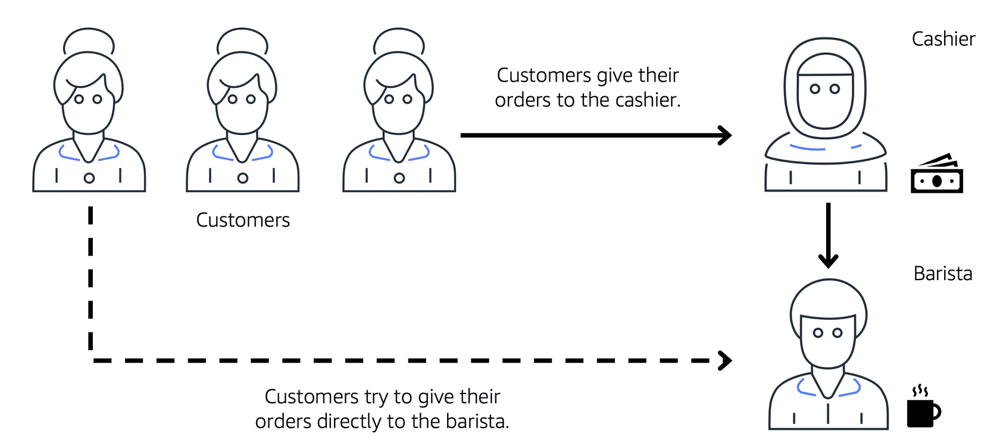

# _AWS Cloud Practitioner Essential Course_

# Module 1

## Cloud computing
The on-demand delivery of IT Resources over the internet with pay-as-you-go pricing

## Different Service

### Amazon Elastic Compute Cloud (Amazon EC2)
Virtual servers called EC2 instance

#### Amazon EC2 instance families
1. General Purpose
2. Compute optimized
3. Memory optimized
4. Accelerated computing
5. Storage optimized

#### Scaling and Availability service

EC2 can be scaled vertically by resizing 
EC2 can be scaled horizontally by launching new pool

**Amazon EC2 Auto scaling** - Automated horizontal scaling
**Elastic Load Balancing (ELB)** - Distribution of request across horizontally scaled instances

#### EC2 billing options

1. On-demand, which is the most flexible and has no contract. 
2. Spot pricing, which allows you to utilize unused capacity at a discounted rate. 
3. Savings plans or reserved instances, which allow you to enter into a contract with AWS to get a discounted rate when you commit to a certain level of usage 
4. Dedicated instance Savings plans which apply to AWS Lambda and AWS Fargate, as well as EC2 instances.

#### Messaging service
**Amazon Simple Queue Service (Amazon SQS)** - This service allows you to decouple system components. Messages remain in the queue until they are either consumed or deleted. 
**Amazon Simple Notification Service(Amazon ANS)** -  is used for sending messages like emails, text messages, push notifications or even HTTP requests. Once a message is published, it is sent to all the subscribers.

#### types of compute services

AWS has different types of compute services beyond just virtual servers like EC2, container orchestration tools, You can use these tools with EC2 instances
**Amazon Elastic Container Service or ECS**

**Amazon Elastic Kubernetes Service or EKS**

**Serverless computing**
 You can use **AWS Fargate**, which allows you to run your containers on top of a serverless compute platform. 

Then there is **AWS Lambda**, which allows you to just upload your code and configure it to run based on triggers. You only get charged for when the code is actually running, no containers, no virtual machines, just code and configuration. 

# Module 2

## AWS Global Infra an reliability

Goal is to be highly available and Fault tolerant.

### Regions
**Regions** are geographically isolated areas.

Data never leaves region unless you ask for.

Four factors to choose Region
1. Compliance
2. Proximity to user
3. Feature Availability
4. Pricing

### Availability Zones (AZ)
Region contains **Availability Zones(AZ)** _seperated bey 10 of miles from each other_

Choose multiple Availability zones for your app.

Recommendation is to choose multiple EC2s  within a region but in different availability zones.

### Amazon Cloud Front service
**Edge Locations** run **Amazon Cloud Front** (_Content Delivery Network Cached copy near user_) 

## Provisioning of AWS Resources

Everything is API's in AWS

### Ways to interact
1. AWS Management console - _UI_
2. AWS Command Line Interface - _commandline for scripting_
3. Software development kits (SDKs) - _integration with programs in different programming languages_
4. Managed tools 
   1. **AWS Elastic Beanstalk** -you provide code and configuration settings, and Elastic Beanstalk deploys the resources necessary to perform the following tasks 
      1. Adjust capacity 
      2. Load balancing 
      3. Automatic scaling 
      4. Application health monitoring
      
   2. Software development kits (SDKs) - you can treat your infrastructure as code, json based / yaml , acts as input for Cloud formation engine. manages different resources like storage, database, analytics , machine learning etc.

# Module 3

## Networking

Amazon Virtual Private Cloud (VPC) -  A VPC lets you provision a logically isolated section of the AWS cloud where you can launch AWS resources in a virtual network that you define

Public anf private grouping of resource is called **subnets**

### Connectivity to AWS

#### Amazon Virtual Private Cloud (Amazon VPC)
magine the millions of customers who use AWS services. Also, imagine the millions of resources that these customers have created, such as Amazon EC2 instances. Without boundaries around all of these resources, network traffic would be able to flow between them unrestricted. 

A networking service that you can use to establish boundaries around your AWS resources is Amazon VPC.

#### Internet gateway
To allow public traffic from the internet to access your VPC, you attach an internet gateway to the VPC.

#### Virtual Private Gateway
The virtual private gateway is the component that allows protected internet traffic to enter into the VPC.

#### AWS Direct Connect
AWS Direct Connect is a service that enables you to establish a dedicated private connection between your data center and a VPC.
The private connection that AWS Direct Connect provides helps you to reduce network costs and increase the amount of bandwidth that can travel through your network

### Subnets and Network Access Control Lists
To learn more about the role of subnets within a VPC, review the following example from the coffee shop.

First, customers give their orders to the cashier. The cashier then passes the orders to the barista. This process allows the line to keep running smoothly as more customers come in.

Suppose that some customers try to skip the cashier line and give their orders directly to the barista. This disrupts the flow of traffic and results in customers accessing a part of the coffee shop that is restricted to them.

To fix this, the owners of the coffee shop divide the counter area by placing the cashier and the barista in separate workstations. The cashier’s workstation is public facing and designed to receive customers. The barista’s area is private. The barista can still receive orders from the cashier but not directly from customers.

This is similar to how you can use AWS networking services to isolate resources and determine exactly how network traffic flows.

In the coffee shop, you can think of the counter area as a **VPC**. The counter area divides into two separate areas for the cashier’s workstation and the barista’s workstation. In a VPC, subnets are separate areas that are used to group together resources.

#### Subnets
A subnet is a section of a VPC in which you can group resources based on security or operational needs. Subnets can be **public** or **private**.

**Public subnets** contain resources that need to be accessible by the public, such as an online store’s website.

**Private subnets** contain resources that should be accessible only through your private network, such as a database that contains customers’ personal information and order histories.

In a VPC, subnets can communicate with each other. For example, you might have an application that involves Amazon EC2 instances in a public subnet communicating with databases that are located in a private subnet.

#### Network Traffic in a VPC
When a customer requests data from an application hosted in the AWS Cloud, this request is sent as a packet. A packet is a unit of data sent over the internet or a network.

It enters into a VPC through an **internet gateway**. Before a packet can enter into a subnet or exit from a subnet, it checks for permissions. These permissions indicate who sent the packet and how the packet is trying to communicate with the resources in a subnet.

The VPC component that checks packet permissions for subnets is a **network access control list (ACL)**.

#### Network Access Control Lists (ACLs)
A network access control list (ACL) is a virtual firewall that controls inbound and outbound traffic at the subnet level.

For example, step outside the coffee shop and imagine that you are in an airport. In the airport, travelers are trying to enter into a different country. You can think of the travelers as packets and the passport control officer as a network ACL. The passport control officer checks travelers’ credentials when they are both entering and exiting out of the country. If a traveler is on an approved list, they are able to get through. However, if they are not on the approved list or are explicitly on a list of banned travelers, they cannot come in.

Each AWS account includes a default network ACL. When configuring your VPC, you can use your account’s default network ACL or create custom network ACLs.

By default, your account’s default network ACL allows all inbound and outbound traffic, but you can modify it by adding your own rules. For custom network ACLs, all inbound and outbound traffic is denied until you add rules to specify which traffic to allow. Additionally, all network ACLs have an explicit deny rule. This rule ensures that if a packet doesn’t match any of the other rules on the list, the packet is denied.

#### Stateless Packet Filtering
Network ACLs perform stateless packet filtering. They remember nothing and check packets that cross the subnet border each way: inbound and outbound.

Recall the previous example of a traveler who wants to enter into a different country. This is similar to sending a request out from an Amazon EC2 instance and to the internet.

When a packet response for that request comes back to the subnet, the network ACL does not remember your previous request. The network ACL checks the packet response against its list of rules to determine whether to allow or deny.

After a packet has entered a subnet, it must have its permissions evaluated for resources within the subnet, such as Amazon EC2 instances.

The VPC component that checks packet permissions for an Amazon EC2 instance is a **security group**.

#### Security Groups
A security group is a virtual firewall that controls inbound and outbound traffic for an Amazon EC2 instance.

By default, a security group denies all inbound traffic and allows all outbound traffic. You can add custom rules to configure which traffic to allow or deny.

For this example, suppose that you are in an apartment building with a door attendant who greets guests in the lobby. You can think of the guests as packets and the door attendant as a security group. As guests arrive, the door attendant checks a list to ensure they can enter the building. However, the door attendant does not check the list again when guests are exiting the building

If you have multiple Amazon EC2 instances within a subnet, you can associate them with the same security group or use different security groups for each instance.

Stateful Packet Filtering
Security groups perform stateful packet filtering. They remember previous decisions made for incoming packets.

Consider the same example of sending a request out from an Amazon EC2 instance to the internet.

When a packet response for that request returns to the instance, the security group remembers your previous request. The security group allows the response to proceed, regardless of inbound security group rules.

Both network ACLs and security groups enable you to configure custom rules for the traffic in your VPC. As you continue to learn more about AWS security and networking, make sure to understand the differences between network ACLs and security groups.

### Global Networking

#### Domain Name System (DNS)
Translating a domain name to an IP address

#### Amazon Route 53

It is a DNS Web service. It gives a reliable way to route internet applications hosted on AWS. It also manages domain names, so we can register our app on it. Amazon Clount from (CDN) work together with Amazon Route 51 to deliver content.

# Module 4

## Storage and Databases

### Amazon Elastic Block Storage (Amazon EBS)
It is a service that provides block-level storage volumes that you can use with Amazon EC2 instances. If you stop or terminate an Amazon EC2 instance, all the data on the attached EBS volume remains available.
To create an EBS volume, you define the configuration (such as volume size and type) and provision it. A

Because EBS volumes are for data that needs to persist, it’s important to back up the data. You can take incremental backups of EBS volumes by creating Amazon EBS snapshots.

#### Amazon EBS Snapshots
It is an incremental backup. This means that the first backup taken of a volume copies all the data. For subsequent backups, only the blocks of data that have changed since the most recent snapshot are saved.

Incremental backups are different from full backups, in which all the data in a storage volume copies each time a backup occurs. The full backup includes data that has not changed since the most recent backup.

### Amazon Simple Storage Service (Amazon S3)
Object Storage, each object consists of data, metadata, and a key. The data might be an image, video, text document, or any other type of file. Metadata contains information about what the data is, how it is used, the object size, and so on. An object’s key is its unique identifier.

**Amazon S3** is a service that provides object-level storage. Amazon S3 stores data as objects in buckets.
Amazon S3 offers unlimited storage space. The maximum file size for an object in Amazon S3 is 5 TB.
When you upload a file to Amazon S3, you can set permissions to control visibility and access to it. 
You can also use the Amazon S3 versioning feature to track changes to your objects over time.

#### Different Amazon S3 storage classes 
Consider these factors to decide which class to go for
* How often you plan to retrieve your data
* How available you need your data to be

1. **Amazon S3 Standard**
   * Designed for frequent accessed data
   * Stores data in minimum three Availability Zones
   * Higher cost then other types of data storage
   * Use case - Websites, content distribution and data analytics

2. **Amazon S3 Standard-Infrequent Access (S3 Standard-IA)**
   * Ideal for infrequent accessed data
   * Similar to **amazon S3 standard** but has **lower storage price and higher retrieval price**.
   * Minimum of three availability zones

3. **Amazon S3 One Zone-Infrequent Access (S3 One Zone-IA)**
   * Stores data in single Availability zone
   * Lower price then Standard IA making a less costlier option bu in case of AZ failure you should be able to reproduce data
   
4. **Amazon S3 Intelligent-Tiering**
   * Ideal for data with unknown or changing access patterns 
   * Requires a small monthly monitoring and automation fee per object
   * Moves data to different storage classes depending on the access/usage

5. Amazon S3 Glacier Instant Retrieval
   * Works well for archived data that requires immediate access 
   * Can retrieve objects within a few milliseconds (Similar to Amazon S3 Standard)

6. Amazon S3 Glacier Flexible Retrieval
   * Low-cost storage designed for data archiving 
   * Able to retrieve objects within a few minutes to hours
   * Use case - storage class to store archived customer records or older photos and video files.

7. Amazon S3 Glacier Deep Archive
   * Lowest-cost object storage class ideal for archiving 
   * Able to retrieve objects within 12 - 48 hours
   * All objects from this storage class are replicated and stored across at least three geographically dispersed Availability Zones.

8. Amazon S3 Outposts
   * Creates S3 buckets on Amazon S3 Outposts 
   * Makes it easier to retrieve, store, and access data on AWS Outposts
   * It works well for workloads with local data residency requirements that must satisfy demanding performance needs by keeping data close to on-premises applications.

### Elastic Block Store Vs Amazon S3

| Amazon Elastic Block Store                 | Amazon S3                                                                    |
|--------------------------------------------|------------------------------------------------------------------------------|
| Sizes up to 16 Tib                         | Unlimited storage, individual objects upto 5 TBs                             |
| Survives termination of their EC2 instance | write once reads many (WORM)                                                 |
| Solid State drives by default              | 99.99999999 % durability                                                     |
| HDD options                                |                                                                              |
| Delta update (use case of video edit)      | Write ones reads many, writing complete objects and retrieving multiple time |
|                                            | Web enabled (multiple pictures to be indexed or unsupervised data)           |

### Amazon Elastic File System (EFS)
* Managed file system(_historically on prem like AFS/NFS_)
* Allows multiple instances access data in EFS at same time
* Scaling is taken care on its own

**Difference between Amazon EBS and Amazon Elastic File System (EFS)**
* EBS - Attached to EC2 instance and present in same AZ. There is no auto-scaling
* EFS - Multiple instances can read and write simultaneously, Its a linux file system and a Regional resource (can be at multiple AZsZ) and it scales automatically.

## Relational Databases
In a relational database, data is stored in a way that relates it to other pieces of data. 

On Prem DBs can be moved to cloud on Amazon EC2, using database migration service.

Managed Database service - **Amazon RDS**

### Amazon RDS 
* It is a managed service that automates tasks such as hardware provisioning, database setup, patching,
* You can integrate Amazon RDS with other services to fulfill your business and operational needs, such as using AWS Lambda to query your database from a serverless application.

### Amazon RDS database engines
Amazon RDS is available on six database engines, which optimize for memory, performance, or input/output (I/O). Supported database engines include:
1. Amazon Aurora
2. PostgreSQL
3. MySQL
4. MariaDB
5. Oracle Database
6. Microsoft SQL Server

### Amazon Aurora
It is an enterprise-class relational database. It is compatible with MySQL and PostgreSQL relational databases. It is up to five times faster than standard MySQL databases and up to three times faster than standard PostgreSQL databases.

### Amazon DynamoDB
* It is a Non-relational Databases
* Key Value database

**Serverless**
DynamoDB is serverless, which means that you do not have to provision, patch, or manage servers.
You also do not have to install, maintain, or operate software.

**Automatic Scaling**
* As the size of your database shrinks or grows, DynamoDB automatically scales to adjust for changes in capacity while maintaining consistent performance.
* This makes it a suitable choice for use cases that require high performance while scaling.

### Amazon Redshift
It is a data warehousing service that you can use for big data analytics. It offers the ability to collect data from many sources and helps you to understand relationships and trends across your data.

### Amazon Database migration service (AWS DMS)
* Enables you to migrate relational databases, nonrelational databases, and other types of data stores.

With AWS DMS, you move data between a source database and a target database.The source and target databases can be of the same type or different types. During the migration, your source database remains operational, reducing downtime for any applications that rely on the database.

For example, suppose that you have a MySQL database that is stored on premises in an Amazon EC2 instance or in Amazon RDS. Consider the MySQL database to be your source database. Using AWS DMS, you could migrate your data to a target database, such as an Amazon Aurora database.

**Other use cases for AWS DMS**
**Development and test database migrations**

Enabling developers to test applications against production data without affecting production users

**Database consolidation**

Combining several databases into a single database

**Continuous replication**

Sending ongoing copies of your data to other target sources instead of doing a one-time migration

